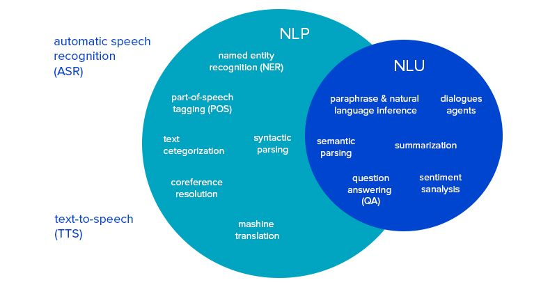

# Basic Problems in NLP (Notebook 1 & 2)

The best introduction to NLP or Natural Language Processing, is to understand the varieties of problems NLP wishes to solve, their categorical breakdowns, a summary of their previous approaches, and a brief overview of how these problems are tackled currently. In this series of notebooks, we hope to do the following things:

* Understand the fundamental problems in NLP
* Understand the divisions between the problems in NLP
* Understand the relationship between NLP and other fields of research
* Briefly introduce both statistical as well as linguistic approaches to solving a variety of the aforementioned problems, the logic behind the solutions, and the unification of the linguistic and statistical approaches (check)
* Briefly understand the basic syntax and definitions of certain terms with pertinence to the English language (in process)
* Introduce the case study of Sentiment Analysis and the scale of even a single problem in NLP

Words that are *italicized* are special vocabulary words that will be extremely helpful to remember and understand for future NLP work. They are also included in a glossary at the end. There are exercises at the end of this section to help you, the reader, understand and work through a simple NLP example and start formulating basic solutions for these complex problems.

## The fundamental problems in NLP and their respective categories

Natural language processing is frequently subdivided into three main categories: Syntax, Semantics, and Pragmatics.

*Syntax* simply refers to the order or arrangement of words in a sentence such that they are grammatically correct. *Semantics* refers to the meaning that is conveyed by a piece of text.
*Pragmatics* is a subfield of linguistics that studies the ways in which context contributes to meaning. Unlike semantics, which examines meaning that is conventional or, in linguistic speak, "coded," in a given language, pragmatics studies how the transmission of meaning depends not only on linguistic as well as structural knowledge (vocabulary, grammar, etc.) of the speaker and the listener, but also on the context of the *utterance*, any pre-existing knowledge about those involved, the inferred intent of the speaker, and other factors. In this respect, pragmatics explains how language users are able to overcome *ambiguity*, since meaning relies on the how, where, when, etc. of an utterance.

The following is a list of some of the most commonly researched tasks in natural language processing. Some of these tasks have direct real-world applications, while others more commonly serve as subtasks that are used to aid in solving larger tasks.

### *Syntax Tasks*

Firstly, there are tasks related to syntax. These are the tasks that have to deal with, in essence, the order of words.

* **Lemmatization** - This is the task of removing “inflectional endings” (i.e. "-ed", "-s", "-ing") only and returning the base dictionary form of a word which, in linguistics, is also known as a lemma. This usually is a subtask, greatly aiding in other tasks like grammar induction. An example of this would be looking at the word "unwavering" and returning "waver" which is the base form of the word.

* **Stemming** - Stemming refers to the process of reducing inflected words to their root form. (e.g. "burp" will be the root for "burped", "burping", "burp", "burps" etc).

  A quick aside to understand the difference between stemming and lemmatization with examples:

  Stemming algorithms work by cutting off the end or the beginning of the word, taking into account a list of common prefixes and suffixes that can be found in an inflected word. This indiscriminate cutting can be successful in some occasions, but not always, and that is why we affirm that this approach presents some limitations. Below we illustrate the method with examples in both English and Spanish.

| **Form** | **Suffix** | **Stem** |
|----------|:----------:|---------:|
| studies  |     -es    |    studi |
| studying |    -ing    |    study |
| niñas    |     -as    |      niñ |
| niñez    |     -ez    |      niñ |

  Lemmatization, on the other hand, takes into consideration the morphological analysis of the words. To do so, it is necessary to have detailed dictionaries which the algorithm can look through to link the form back to its lemma. Again, you can see how it works with the same example words.

| **Form** |                  **Morphological Information**                  | **Lemma** |
|----------|:---------------------------------------------------------------:|----------:|
| studies  | Third person, singular number, present  tense of the verb study |     study |
| studying |                     Gerund of the verb study                    |     study |
| niñas    |         Feminine gender, plural number of the noun niño         |      niño |
| niñez    |                Singular number of the noun niñez                |     niñez |

  First, the stem can be the same for the inflectional forms of different lemmas. This translates into noise in our search results. In fact, it is very common to find entire forms as instances of several lemmas; In Telugu, the form for “robe” is identical to the form for “I don’t share”, so their stems are indistinguishable too. But they, of course, belong to different lemmas. The same happens in Gujarati, where the forms and stems for “beat” and “set up” coincide, but we can separate one from another by looking at their lemmas. Also, the same lemma can correspond to forms with different stems, and we need to treat them as the same word. For example, in Greek, a typical verb has different stems for perfective forms and for imperfective ones. If we were using stemming algorithms, we won't be able to relate them with the same verb, but using lemmatization it is possible to do so.

* **Morphological segmentation** - *Morphology* is a fancy way of saying the structure of words. Morphological segmentation basically means to separate words into their individual parts, or in linguistic speak, their individual *morphemes*, and identify the “class”, or type, of the morphemes. The difficulty of this task depends greatly on the complexity of the morphology of the language being considered. English has fairly simple morphology, especially inflectional morphology (meaning English doesn’t have many prefixes and suffixes that change the meaning of a word), and thus it is often possible to ignore this task entirely and simply model all possible forms of a word (e.g. "prickle, prickles, prickled, prickling") as separate words. In languages like Turkish and Arabic, however, such an approach is not possible, as each dictionary entry has thousands of possible word forms.

* **Part-of-speech (POS) tagging** - The task is simple and exactly what it sounds like: given a sentence, determine the part of speech (or POS, for short) for each word in that sentence. Obviously, in English, many words, especially common ones, can serve as multiple parts of speech. For example, "book" can be a noun ("the book on the table") or verb ("to book a hotel"); "bank" can be a noun ("river bank") or verb ("plane banking"); and "in" can be at least four different parts of speech. Some languages have more of this type of ambiguity than others. Languages with little inflectional morphology (look above for a quick definition), such as English, are particularly prone to such ambiguity. Chinese is prone to such ambiguity because it is a tonal language during verbalization. The tonal type of inflection is not easily conveyed through text, adding to the ambiguity of the sentence. Ambiguity is a fairly large topic in NLP and is the source of a lot of frustration and complexity in language models. More on that after the description of these tasks.

* **Sentence breaking** - This task refers to the process of, given a chunk of text, finding the sentence boundaries. Sentence boundaries are often marked by periods or other punctuation marks, but these same characters can serve other purposes (e.g. marking abbreviations). Having a task that explicitly can mark the end of sentences and the beginning of the next is quite helpful in a variety of other tasks downstream.

* **Word segmentation** - Word segmentation is also exactly what it sounds like. The task is to separate a chunk of continuous text into separate words. For a language like English, this is fairly trivial, since words are usually separated by spaces. However, some written languages like Chinese, Japanese and Korean do not mark word boundaries in such a fashion, and in those languages, word segmentation is a significant task requiring knowledge of the vocabulary and morphology of the words in the language.

* **Terminology extraction** - The goal of terminology extraction is to automatically extract relevant terms from a given corpus. Imagine this entire document was used for terminology extraction. The task would be to automatically extract the terms like "stemming" and "lemmatization" and "syntax" and "semantics."

* **Grammar induction** - A task in which the end product is the generation of a formal grammar that describes a language's syntax; this task usually has multiple underlying pieces that fit together to create the “formal grammar.”

* **Parsing** - This task is relatively difficult and composed of multiple subtasks. The overview is to determine the parse tree or the "grammatical analysis" of a given sentence. This is similar to "diagramming" a sentence; understanding the words, parts of speech, how these fit together, what modifies what, etc. The grammar for natural languages is ambiguous and typical sentences have multiple possible analyses. In fact, perhaps surprisingly, for a typical sentence there may be thousands of potential parses (most of which will seem completely nonsensical to a human). There are two primary types of parsing, Dependency Parsing and Constituency Parsing. Dependency Parsing focuses on the relationships between words in a sentence (marking things like Primary Objects and predicates, whereas Constituency Parsing focuses on building out the Parse Tree using a Probabilistic Context-Free Grammar (PCFGs), basically turning a sentence into a sum of its parts. For example, for the sentence "John sees Bill," the constituency parse tree would look like so: (S (N) (VP V N)). S stands for subject, N for noun, VP for verb phrase, V for verb, and N for noun. The sentence fundamentally would be separated around the subject and verb phrase, the subject being John, the verb phrase being "sees Bill." Then it further breaks down the verb phrase into its "constituents" or the pieces that make it up, that being the verb (sees) and the noun (Bill).

### *Semantic and Pragmatic Tasks*

There are two main types of semantics when someone says the word semantics: lexical semantics and distributional semantics. Lexical semantics answers the question of "what is the computational meaning of individual words in context." Distributional semantics is simply concerned with learning semantic representations from the data. The distributional hypothesis in linguistics is derived from the semantic theory of language usage, i.e. words that are used and occur in the same contexts tend to purport similar meanings. The underlying idea is that "a word is characterized by the company it keeps."

The distributional hypothesis is the basis for statistical semantics. In recent years, the distributional hypothesis has provided the basis for the theory of similarity-based generalization in language learning: the idea that children can figure out how to use words they've rarely encountered before by generalizing about their use from distributions of similar words.

The distributional hypothesis suggests that the more semantically similar two words are, the more distributionally similar they will be in turn, and thus the more that they will tend to occur in similar linguistic contexts.

These tasks below relating to semantics or the meanings of words are majority modeled on this hypothesis, and only recently have introduced pragmatics (i.e. the contextual meanings vs only context or ordering (syntax) or only meaning (semantics)) into play:

* **Recognizing Textual entailment** - Entailment is an important concept and word that appears multiple times thoughout NLP literature. Entailment can be illustrated with examples of three different relations:

  * An example of a positive TE (text entails hypothesis) is:  __text__: If you help the needy, God will reward you.  __hypothesis__: Giving money to a poor man has good consequences.

  * An example of a negative TE (text contradicts hypothesis) is:   __text__: If you help the needy, God will reward you.   __hypothesis__: Giving money to a poor man has no consequences.

  * An example of a non-TE (text does not entail nor contradict) is:  __text__: If you help the needy, God will reward you. __hypothesis__: Giving money to a poor man will make you a better person.

&nbsp;&nbsp;&nbsp;&nbsp;Given two text fragments, determine if one being true entails the other, entails the other's negation, or allows the other to be either true or false.

* **Word sense disambiguation** - Many words have more than one meaning; we have to select the meaning which makes the most sense in context. A word's *sense* is the meaning of that particular word in that context. For this problem, we are typically given a list of words and associated word senses, e.g. from a dictionary or from an online resource such as WordNet. The task is to disambiguate between the word senses when given a context.

* **Topic segmentation and recognition** - Topic segmentation and recognition requires a bit of understanding of the content of the text. The task is, given a chunk of text, separate it into segments each of which is devoted to a topic, and identify the topic of the segment.

* **Relationship extraction** - Relationship extraction is similar to entailment, but more generalized. The task is that given a chunk of text, identify the relationships among named entities (e.g. who is married to whom, where the event took place, whose cat is it etc.).

* **Sentiment analysis** - Sentiment analysis is one of the most basic tasks of NLP and is used constantly as an example because of its varying difficulty depending on the approach. The task is to extract subjective information usually from a set of documents, often using online reviews to determine "polarity" about specific objects. It is especially useful for identifying trends of public opinion in social media, for the purpose of marketing.

* **Machine translation** - This is the task most people think of when it comes to NLP. The task is simple: like Google Translate, automatically translate text from one human language to another. This is one of the most difficult problems, and is a member of a class of problems colloquially termed "AI-complete", i.e. requiring all of the different types of knowledge that humans possess (grammar, semantics, facts about the real world, etc.) in order to properly solve. In the 1950s, machine translation became a reality in research; The Georgetown experiment, which involved successful fully automatic translation of more than sixty Russian sentences into English in 1954, was one of the earliest recorded projects. Researchers of the Georgetown experiment asserted their belief that machine translation would be a solved problem within three to five years. They, as well as most laypersons, underestimated the complexity and the far-reaching consequences of solving this problem, including the number of subtasks that would be required to accurately understand and translate a piece of text. The array of subtasks is left as an exercise to the reader in the exercises section.

* **Named entity recognition (NER)** - NER is another large area of NLP. The task is that given a stream of text, determine which items in the text map to proper names, such as people or places, and what the type of each such name is (e.g. person, location, organization). Although capitalization can aid in recognizing named entities in languages such as English, this information cannot aid in determining the type of named entity, and in any case is often inaccurate or insufficient. For example, the first letter of a sentence is also capitalized, and named entities often span several words, only some of which are capitalized. Furthermore, many other languages in non-Western scripts (e.g. Arabic or Mandarin) do not have any capitalization at all, and even languages with capitalization like German may not consistently use it to distinguish only names. For example, German capitalizes all nouns, regardless of whether they are names, and French and Spanish do not capitalize names that serve as adjectives. This aids and directly influences the task of coreference resolution which we go into further detail on below.

* **Natural language generation (NLG)** - This task rears its head as one of the hardest subtasks: NLG refers to the process that transforms structured data into natural language. It can be used to produce long form content for organizations to automate custom reports, as well as produce custom content for a web or mobile application. It can also be used to generate short blurbs of text in interactive conversations, like a chatbot, which might even be read out loud by a text-to-speech system like our Google Home or Amazon Alexa. NLG can be compared to the process humans use when they turn ideas into writing or speech. Psycholinguists prefer the term language production for this process, which can also be described in mathematical terms, or modeled in a computer for psychological research. NLG systems can also be compared to translators of artificial computer languages, such as decompilers or transpilers, which also produce human-readable code generated from an intermediate representation. Human languages, though, tend to be considerably more complex and allow for much more ambiguity and variety of expression than programming languages, which makes NLG increasingly more challenging.

* **Natural language understanding (NLU)** - Natural language understanding is another massive topic in NLP. The task is to convert chunks of text into more formal representations like first-order logic structures (not necessarily FOL structures, can be hidden human incomprehensible structures), that are easier for a model from which to pull out information. Natural language understanding involves the identification of the intended semantic from the multiple possible semantics which can be derived from a natural language expression which usually takes the form of organized notations of natural language concepts. In other words, the goal is to understand the intended meaning from the variety of meanings words/phrases can have (ambiguity). Introduction and creation of a language "metamodel" is the aim of the linguistic solution to this problem, but although efficient, empirical solutions aren't usually generalizable.

NLP is the sum of the two aforementioned parts: NLU and NLG. It is quite common to confuse specific terms in this fast-moving field of Machine Learning and Artificial Intelligence. The above is the same case where the three words are interchanged as pleased.

NLP could be referred to as the combination of NLU and NLG will result in an NLP engine that works. NLU is the understanding the meaning of what the user or the input which is given means. That is nothing but the understanding of the text given and classifying it into proper intents.

Let us take an example here: “Can I play cricket today”
What would the NLP model actually do? Here the user intention is playing cricket but however, there are many possibilities that should be taken into account. One of the dependency would be “Checking the weather outside”.

If it is raining outside since cricket is an outdoor game we cannot recommend playing right? As you can see we need to get it into structured data here so what do we do? We make use of intent and entities.

**Intents**:
Intents are nothing but verbs (activities that the user needs to do). If we want to capture a request, or perform an action, use an intent. In the example "play" is the intent.
**Entities**:
Entities are the nouns or the content for the action that needs to be performed. In this case, cricket is a noun.
It is possible to have multiple intents (like checking the weather, checking ground available, checking friends availability) for a single entity playing and also multiple entities for intent and multiple intents for multiple entities. This again arises the issue of ambiguity.

Additionally, the intents and entities can change based on the previous chats.

Let's take a simple example of a user and a chatbot conversing about playing cricket:

1. User: Can I play cricket?
Chatbot: The weather is bad outside, I wouldn't suggest playing cricket right now!
2. User: What about football?
Chatbot: The weather is still bad! It might not be wise to play right now.
3. User: Can I watch it at least?
Chatbot: Sure, you can watch cricket.

Step 1: The entity is cricket, and the intent is play.
Step 2: The entity is football, and the intent is play.
Step 3: the entity is football, but the intent now is watch. The entity isn't specifically mentioned but is surmised from the previous conversation. This is one of the keys for NLU.

So how does NLG, NLU and NLP work together?

NLU takes up the understanding of the data based on grammar, the context in which it was said and decides on intent and entities.
NLP will convert the text into structured data.
NLG generates text based on the structured data.

A handy graphic for understanding where some subtasks lay for NLU and NLP will help clarify the differences.

* **Question answering** - Question answering is one of the most natural forms of communication a human can have with an entity, whether human or otherwise. The task is given a human-language question, determine its answer; simple in principle, complex in execution. Typical questions have a specific right answer (such as "What is the capital of New York State?"), but sometimes open-ended questions are also considered (such as "What is love? (Baby, don't hurt me)").

The remaining tasks are fundamentally a bit different from the rest. The tasks need to take in greater context and require the entire document's informations to make informed decisions.

* **Automatic summarization** - Auto summarization is also simplistic in its goal, being to produce a comprehensible summary of a chunk of text. The task is often used to provide summaries of text of a known type, such as research papers, articles in the financial section of a newspaper, highlighting important information and disregarding those less important.

* **Coreference resolution** - Coreference resolution ties in with NER. The goal is given a sentence or larger chunk of text, determine which words refer to the same objects. Anaphora resolution is a specific example of this task, and is specifically concerned with matching up pronouns with the nouns or names to which they refer. This is the most common type of coreference resolution you see in NLP, although there's still the more general task of coreference resolution which also includes identifying so-called "bridging relationships" involving referring expressions. For example, in a sentence such as "The robber entered the pavilion through the main hall", "the main hall" is a "referring expression" and the bridging relationship that would need to be identified is the fact that the main hall that's being referenced is the main hall of the pavilion rather than somewhere else.

Now that you, the reader, has started to understand the breadth and depth of NLP tasks, it's time to understand the complexities of NLP versus various other Machine Learning problems. The problems arise from two key issues of natural language: ambiguity and compositionality.

## Ambiguity

To properly understand what these mean to a practitioner of NLP, we have to fundamentally understand what the goal of NLP actually is and how we approach problems in NLP in general. These challenges require good design techniques; both modular approaches to break a problem up at appropriate points into smaller challenges, and the more formal models which reflect aspects of the structure of language. These problems are different and slightly more challenging than other typical Machine Learning problems because of two main facets of language: ambiguity and compositionality.

Ambiguity can be referred as the ability of having more than one meaning or being understood in more than one way. Natural languages are ambiguous, so computers are not able to understand language the way people do. Natural Language Processing (NLP) is concerned with the development of computational models of aspects of human language processing. Ambiguity can occur at various levels of NLP. Ambiguity could be Lexical (word-level), Syntactic (dealing with order of words), Semantic (dealing with meaning of words), Pragmatic (dealing with contextual meanings) etc. A quick example follows to explain this better.

The sentence "You have the red light" is ambiguous. Without knowing the context, the identity of the speaker or the speaker's intent, it is difficult to infer the meaning with certainty. For example, it could mean:
                * the space that belongs to you has red ambient lighting;
                * you are stopping at a red traffic signal; and you have to wait to continue driving;
                * you are not permitted to proceed in a non-driving context;
                * your body is cast in a red glow; or
                * you possess a light bulb that is tinted red.

Similarly, the sentence "Greyson saw the man with glasses" could mean that Greyson observed the man by using glasses, or it could mean that Greyson observed a man who was holding/wearing glasses (syntactic ambiguity). The meaning of the sentence depends on an understanding of the context and the speaker's intent. As defined in linguistics, a sentence is an abstract entity—-a string of words divorced from non-linguistic context--in contrast to an utterance, which is a concrete example of a speech act in a specific context. The more closely conscious subjects stick to common words, idioms, phrasings, and topics, the more easily others can surmise their meaning; simultaneously, the further they stray from common expressions and topics, the wider the variations in interpretations.

This suggests that sentences do not have an intrinsic meaning, that there is no meaning associated with a sentence or word, and that either can only represent an idea symbolically. "The dog sat on the carpet" is a sentence in English. If someone were to say to someone else, "The dog sat on the carpet," the act is itself an utterance. This implies that a sentence, term, expression or word cannot symbolically represent a single true meaning; such meaning is underspecified (which dog sat on which carpet?) and consequently, is potentially ambiguous. By contrast, the meaning of an utterance can be inferred through knowledge of its context, or pragmatics, leveraging both its linguistic and non-linguistic contexts (which may or may not be sufficient to resolve ambiguity). You may factually know from previous conversations it's your neighbour's dog, or the carpet referred to is the Persian carpet you keep in your bedroom, or even that the dog didn't actually sit normally, because the neighbour's dog has a hip problem and causes him to lay more than sit, yet the closest word to describe what the dog did is to use sit. All of these are ambiguous from the sentence "The dog sat on the carpet," and having a limited context can allow the sentence to become more and more ambiguous and answer less and less questions.

## Compositionality and the linguistic connection

Compositionality is the other beast that presents itself as a basic roadblock in the field of NLP.

The field of NLP used to be divided by methodologies and near-term goals. Logical approaches relied on techniques from proof theory and model-theoretic semantics, they have strong ties to linguistic semantics, and they are concerned primarily with inference, ambiguity, vagueness, and compositional interpretation of full syntactic parses. In contrast, the statistical approaches derived their tools from algorithms and optimization, and they tend to focus on word meanings and broad notions of semantic content.

The two types of approaches share the long-term vision of achieving deep natural language understanding, but their day-to-day differences can make them seem unrelated and even incompatible. The distinction between logical and statistical approaches has and is continuing to rapidly disappear, with the development of models that can learn the conventional aspects of natural language meaning from corpora and databases. These models interpret rich linguistic representations in a compositional fashion, and they offer novel perspectives on foundational issues like ambiguity, inference, and grounding. The fundamental question for these approaches is what kinds of data and models are needed for effective learning. Addressing this question is a prerequisite for implementing robust systems for natural language understanding, and the answers can inform psychological models of language acquisition and language processing.

The leading players in the discussion are the aforementioned ambiguity, as well as compositionality. It is deeply united around the concepts of generalization, meaning, and structural complexity. Specifically, compositionality characterizes the recursive nature of the linguistic ability required to generalize to a creative capacity, and learning details the conditions under which such an ability can be acquired from data.

In linguistics, semantic representations are generally logical forms: expressions in a fully specified, unambiguous artificial language. The grammar in tasks like parsing usually adopt such a view, defining semantic representations with a logical language that has constant symbols for numbers and relations and uses juxtaposition and bracketing to create complex expressions. In the literature, one encounters a variety of different formalisms — for example, lambda calculi (Carpenter 1997) or first-order fragments thereof (Bird et al. 2009), natural logics (MacCartney & Manning 2009; Moss 2009), diagrammatic languages (Kamp & Reyle 1993), programming languages (Blackburn & Bos 2005), robot controller languages (Matuszek et al. 2012b), and database query languages (Zelle & Mooney 1996). A given utterance might be consistent with multiple logical forms in our grammar, creating ambiguity.

Compositionality and learning are intimately related: Both concern the ability of a system (human or artificial) to generalize from a finite set of experiences to a creative capacity, and to come to grips with new inputs and experiences effectively. From this perspective, compositionality is a claim about the nature of this ability when it comes to linguistic interpretation, and learning theory offers a framework for characterizing the conditions under which a system can attain this ability in principle. Moreover, establishing the relationship between compositionality and learning provides a recipe for synthesis: the principle of compositionality guides researchers on specific model structures, and machine learning provides them with a set of methods for training such models in practice. More specifically, the claim of compositionality is that being a semantic interpreter for a language L amounts to mastering the syntax of L, the lexical meanings of L, and the modes of semantic combination for L.

## Relationships to other fields

To provide a small respite to the reader from the heavily detailed text, we analyse the relationship NLP has to three key fields: Linguistics, AI, and Statistics.

As evidenced above, NLP is heavily related to linguistics and many of the tasks as well as breakdowns of problems are linguistically based. The terms and definitions for giving language structure have already been well-defined by linguistics. The overall goal of the field is lofty yet simple: to describe language, whether through simple models which can predict language behaviour, or through complex machine learning models that we'll build soon. The goal is to understand what's actually universal about a language, and through these formal models that are usually logic based, understand how language can be acquired. Formal models from linguistics have been of particular value in NLP, yet the goals are not the same as NLP. A single counterexample can invalidate a model in linguistic theory, but wouldn't necessarily lessen its value significantly for NLP. NLP must address all the pheonomena that arise in an application, while linguistics usually may focus on a select set of phenomena to give insight into the language faculty.

NLP and AI are usually interlinked, yet are fundamentally different. A classical "symbolic" AI is concerned primarily with the generic problem solving strategies and suitable knowledge representations for sets of data, and generalization from that set of data. There is an inherent link between AI and NLP as some NLP problems require the sort of deep reasoning addressed by some of these fundamental AI methods; but NLP as well as AI has found more success through avoiding this deep reasoning and instead turning to Statistics.

Machine Learning, or glorified mass-data statistics, started off at a disadvantage for NLP. Previously, the NLP systems that were symbolic and hand-crafted. Statistical models advanced with the era of computation we've had since the 1990's, allowing for easily trainable and easily computable models that are much more complex than the hand-crafted ones we had previously. Furthermore, the plethoric data for NLP in the world combined with the era of computation, has made the growth of neural network or Deep Learning models for NLP increasingly more rapid, each model improving on the performance of the last, especially improving on the earlier models (e.g. the log linear models).

## Basic syntactic structure of English

One of the most helpful ways to get into NLP and more linguistic studies, is to first understand the basics of a single language. Here, we cover a brief overview of some key linguistic terms, their plain english equivalents, and examples of each. We also cover basic syntactic structure of the English language so when addressing certain pieces of a text, more specific language can be leveraged for a greater understanding of models' learnings and failings.

Firstly, let's start by reviewing parts of speech. Parts of speech are labels or identifiers that indicate the role a word may play in a sentence. The most major parts of speech are nouns, verbs, adjectives, and adverbs. These are considered "open classes," while parts of speech like pronouns, prepositions, and conjunctions are considered "closed classes." This is as a result of the fact that the closed classes can be specifically enumerated with little effort, while the open classes are not very limited in their scopes. In English in particular, the same word may have several parts of speech, contributing to the ambiguity problem rampant throughout NLP.

A *noun* is a person, place or thing. It can have a plural or possessive form, like cat -> cats or cat -> cat's/cats'
There's also a difference between countable nouns vs. mass nouns; singular countable nouns appear with a determiner. This is linguistic speak to say a singular noun that can be counted and is specific, must have a determiner, or the word "the" or "a" along with it (usually articles or possessive pronouns (i.e. my, his, etc)). For example, one could say "Cats sleep," but to say "cat sleeps" is grammatically incorrect as there is no determiner in the sentence. "The cat sleeps" or "My cat sleeps" is the correct form of that sentence. In languages like Mandarin, there isn't always this same difference.

A *verb* is simply an action; the easiest test is to put a verb into the sentence "they must ____ it" where the blank is the word. Most verbs can appear in different inflected forms. The several forms can be simplified to the following five: base/infinitive form ("be"; "eat"; "sleep"), present tense ("is", "am", "are"; "eats","eat"; "sleeps", "sleep"), past tense ("was", "were"; "ate"; "slept"), present participle ("being","eating"; "sleeping"), or past participle ("been"; "eaten"; "slept").

*Adjectives* describe nouns. No matter the base form of the word, any word that describes a noun is considered an adjective. They can appear in comparative or superlative forms (happy -> happier (comparative), happiest (superlative)) as well as with an intensifier (an adverb in nature, i.e. happy -> very happy). We cannot consider a word an adjective just because it appears as a modifier to the left of a noun (the brick wall). Most nouns can appear in this position.

*Adverbs* describe the action of the sentence. Their most unique characteristic in English is their movement throughout a sentence. All of the following are using the adverb "quickly," but they all appear in different places.

- He ate the brownie quickly.
- He quickly ate the brownie.
- Quickly, he ate the brownie.

*Pronouns* are words that refer to nouns but don't directly use the noun itself. Examples of pronouns are I, he, him, them, they, etc. Personal pronouns are pronouns that refer to a person in particular. They can occur in the nominative (I/he) or accusative (me, him). Nominative means in place of the subject of the sentence or phrase, or accusative means used in an object portion of the sentence or phrase.  

The word *phrase* has come up multiple times. Phrases can be classified by the part of speech of the main word and the syntactic role it plays in the sentence. For example, in the sentence "The young cats drink milk," "The young cats" is a noun phrase, or in other terms, the subject of the sentence, and "drink milk" is the verb phrase or predicate of the sentence.

To tie back into verbs, verbs must be followed by particular structures appropriate to the verb, or what is called the *verb's complement* (note the spelling!). Here are examples of some of the complements that can occur in different parts of the sentence:

- Noun phrase: I served __a brownie__.
- Adjective phrase: I remained __very rich__.
- Prepositional phrase: I looked __at Fred__.
- Particles: He looked __up__ the number.

If a verb can occur without a complement, like in the example, "He died," the verb is considered *intransitive*.

Prepositions and particles are hard to distinguish: prepositions must precede the noun phrase while particles can change places with the noun phrase. For example: "he looked up the number" versus "he looked the number up" is an example of a particle. A preposition must always precede the noun phrase: "he walked into the room" versus "he walked the room into" (doesn't make sense). So what's the point of distinguishing these two concepts? Because the two constructs may have very different meanings, evident especially in ambiguous examples like "He looked up the street."

You may also have clausal complements that in and of itself may be a complete sentence. For example, in the sentence "I dreamt I won a million koalas," the complement of the verb "dreamt" here, is the entire phrase "I won a million koalas."

*Adjuncts* are different than complements. A verbal modifier, or an adjunct, can be deleted without changing the basic meanings of a sentence. For example:

> He treated her __in the doctor's office__.

Here, it's easily possible to delete the underlined phrase without fundamentally changing the meaning of the sentence. While that's the case for adjuncts, for complements, a deletion would result in a change of meaning. For example:

> He treated her __as an equal__.

The difference is not always clear cut, and each may have different readings associated with the same format. For example:

> He seemed to please his teacher [complement]
> He appeared to please his teacher [ambiguous]
> He disappeared to please his teacher [adjunct]

Noun phrase structure is also consistent syntactically for the most part in English. A noun may be modified on the left by a determiner, a quantifier, an adjective, or another noun. In the example "the six big brick walls," the determiner is the first word "the", quantifier is the number "five", the adjective is the descriptor "big", and the other noun "brick." A noun phrase can also have descriptors on the right, with prepositional phrases, appositions, and relative clauses. An example for each is listed below:

- Prepositional Phrase: ... the man __on the moon__ ...
- Apposition: ... Tommy, __the noble knight__, ...

Relative clauses require a bit more explanation. A relative clause is just like a sentence but just with a missing noun phrase. For example "the explorer who found the new country" or "the new country which the man found." The easiest way to understand this is that the gap can be filled with the subject of the larger noun phrase: "The explorer found the new country" where new country could be moved from the beginning of the phrase to the end of the phrase or vice versa swapping in explorer. Reduced relative clauses are other forms of relative clauses that are shortened, where the verb for of "to be" is used in the sentence. For example: "the man who is running in the marathon" can be shortened to "the man running in the marathon." "Is" is the verb form of "to be" here, and allows for this clause to be shortened.

And last but not least, are conjunctions. Conjunctions simply link the same parts of speech together to form a more complex, person, place, thing, action, descriptor, etc. It's in essence, the combiner. The words "and", "or", and "but" are all conjunctions and can be used with all parts of speech. There are also the negative versions of these conjunctions with "nor" and "neither."

- noun: I like turtles and raccoons.
- verb: I sat and read the newspaper.
- adjective: The girl was both smart and beautiful
- adverb: The wannabe ninja snuck up on him neither quickly nor quietly.

English is a special case of language. We tend to ignore certain problems by focus on English as the main language. Firstly, text segmentation is not an issue in English at all. In languages like Japanese and Chinese, there's an entire stage of processing for any NLP task which involves segmenting the text into words as a combination of characters. In addition, there's a highly limited morphology in English; one can enter all word forms in a dictionary, because inflectional and derivational morphology are relatively simple. This basically refers to verb tenses, singular/plural words, and nominalization (manipulate -> manipulation). Additionally, English is relatively fixed in its word order; in languages like Arabic or Chinese, there's a freer word order, but even freer word order in languages with case markings.

The other large problem with focusing our efforts on a single language, despite the ease in some ways, is the problem of code switching. Code switching is in essence, language alternation. When most Indian people talk, especially from Northern India, the languages they speak are an amalgamation of two (English and Hindi) to anywhere as many as five or six languages (English, Hindi, Gujurati, Urdu and Memoni) at a time. In mainstream literature, movies, Bollywood, etc., code switching is plethoric. In addition, Latin American countries frequently litter their language with Spanish words and grammatical differences between Spanish and English, or Portugese and English. These all are uniquely human ways of talking, defaulting to the comfortable concept and grammatical structure that is most convenient for the speaker/writer. The issue with this is that without a generalizable model, the above tasks become increasingly more difficult. The grammar then is not set, but is a combination of the multiple languages the speaker or writer chooses to purvey their message. Parsing becomes different. Homonyms and Phonemes (words that sound the same but mean different things, or words with the same spelling but meaning different things) become even more rampant, the grammar is not necessarily set, and some of the well-defined easier to understand concepts we had above become difficult.

---

In the next notebook, we talk about and code a simple semantic analysis model and demonstrate the variety of steps required to build an NLP model.

## More on CFGs (context-free grammars) DO WE WANT THIS HERE?

            * Context-free grammars
                * consists of non-terminal symbols (including a start symbol), terminal symbols, and productions, rewrite operation
                * derivation = sequence of rewrite operations
                * language defined by a CFG = sequences of terminal symbols derivable from start symbol
                * CFG as a device for
                    * generating sentences
                    * recognizing sentences
                    * parsing sentences
            * natural language grammars typically treat POS as terminal (or pre-terminal) and treat lexical insertion or look-up as a separate process
            * more powerful than regular expressions / finite-state automata
                * some languages which can be captured by CFG cannot be captured by regular expressions
                    * regular expressions can't capture center embedding
                * even if the language can be captured in principle by a reg. expr., it may not be convenient for expressing relations among constituents
        * data sparsity?

## Exercises for the reader
1. Break Machine Translation down into its relative subtasks, and formulate a generic solution on how you'd approach the problem with the amalgamation of other tasks mentioned above.
2. What's a special aspect of the language which you speak compared to a foreign language you have learned (whether it be English vs Mandarin/English vs Turkish etc.)? Is this a syntactic, semantic, or pragmatic difference between the languages? How could a machine start to decipher the meaning behind these different aspects using the tasks mentioned above?

## References:

* https://becominghuman.ai/a-simple-introduction-to-natural-language-processing-ea66a1747b32
* https://en.wikipedia.org/wiki/Pragmatics
* https://en.wikipedia.org/wiki/Syntax (https://en.wikipedia.org/wiki/Syntax)
* https://en.wikipedia.org/wiki/Semantics (https://en.wikipedia.org/wiki/Semantics)
* Artzi Y, Zettlemoyer LS. 2011. Bootstrapping semantic parsers from conversations. In Proceedings of the 2011 Conference on Empirical Methods in Natural Language Processing. Edinburgh: ACL
* Artzi Y, Zettlemoyer LS. 2013. Weakly supervised learning of semantic parsers for mapping instructions to actions. Transactions of the Association for Computational Linguistics 1:49–62
* Baklr G, Hofmann T, Sch¨olkopf B, Smola AJ, Taskar B, eds. 2010. Predicting Structured Data. Cambridge, MA: MIT Press
* Baroni M, Bernardi R, Do NQ, Shan Cc. 2012. Entailment above the word level in distributional semantics. In Proceedings of the 13th Conference of the European Chapter of the Association for Computational Linguistics. Avignon, France: ACL
* Berant J, Chou A, Frostig R, Liang P. 2013. Semantic parsing on Freebase from question–answer pairs. In Proceedings of the 2013 Conference on Empirical Methods in Natural Language Processing. Seattle: ACL
* Berant J, Liang P. 2014. Semantic parsing via paraphrasing. In Proceedings of the 52nd Annual Meeting of the Association for Computational Linguistics Human Language Technologies. Baltimore: ACL
* Bird S, Klein E, Loper E. 2009. Natural Language Processing with Python. Sebastopol, CA: O’Reilly Media Blackburn P, Bos J. 2003. Computational semantics. Theoria 18:27–45
* Dowty D. 2007. Compositionality as an empirical problem. In Direct Compositionality, eds. C Barker, P Jacobson. Oxford: Oxford University Press, 23–101
* van Eijck J, Unger C. 2010. Computational Semantics with Functional Programming. Cambridge: Cambridge University Press
* https://web.stanford.edu/~cgpotts/manuscripts/liang-potts-semantics.pdf
* http://www.ijircce.com/upload/2014/sacaim/59_Paper%2027.pdf
* https://blog.bitext.com/what-is-the-difference-between-stemming-and-lemmatization/
* Image from: https://towardsdatascience.com/nlp-vs-nlu-vs-nlg-know-what-you-are-trying-to-achieve-nlp-engine-part-1-1487a2c8b696

## Glossary/Words you should know at the end of these introduction notebooks:
- semantics
- syntax
- pragmatics
- inflectional endings
- morphology
- morphemes
- part of speech
- stemming
- lexical
