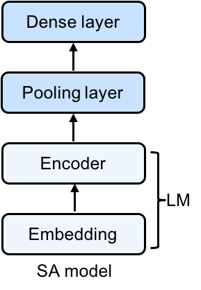

# A Sentiment Analysis Case Study

Now that we've covered most of the basics and terminology in NLP, let's continue on with the basics and show how these tasks can pile up even when addressing the comparatively simple problem of classification. In particular, we'll look at the classic problem of sentiment analysis: taking an input consisting of a string of text and classifying its sentiment as positive or negative.

Sentiment analysis is a vital topic in the field of NLP. It has easily become one of the hottest topics in the field because of its relevance and the number of business problems it is solving and has been able to answer. In this notebook, you will cover this not-so-simple topic in a simple way. You will build a simple sentiment classifier throughout this tutorial. Specifically, you will cover:

- Understanding sentiment analysis from a practitioner's perspective
- Formulating the problem statement of sentiment analysis
- An LSTM implementation of Sentiment Analysis in GluonNLP

Before we get started, let's analyse the subtasks for the given larger task. Let's take a look at this image:


As you can plainly see, sentiment analysis, although one of the easiest tasks in NLP, requires a large number of subtasks. To enumerate them they would be:

- Given a text input, tokenize the input.
- Filter the tokens for stop words.
- Handle negation.
- Perform stemming to analyse the root words.
- Parameterize the input vector for the model.
- Perform classification, and output the sentiment class.

## What is sentiment analysis?

Essentially, sentiment analysis or sentiment classification fall into the broad category of text classification tasks where you are supplied with a phrase, or a list of phrases and your classifier is supposed to tell if the sentiment behind that is positive, negative or neutral. Sometimes, the third attribute is not taken to keep it a binary classification problem. In recent tasks, sentiments like "somewhat positive" and "somewhat negative" are also being considered. Let's understand with an example now.

Consider the following phrases:

"Mulan is a great movie."
"Mulan is not a good movie."
"Mulan is a movie."

The phrases correspond to short film reviews, and each one of them conveys different sentiments. For example, the first phrase denotes positive sentiment about the film Mulan while the second one treats the movie as positively negative (negative sentiment). Take a look at the third one more closely. There is no such word in that phrase which can tell you about anything regarding the sentiment conveyed by it. Hence, the last is an example of neutral sentiment.

Now, from a strict machine learning point of view, this task is nothing but a supervised learning task. You will supply a bunch of phrases (with the labels of their respective sentiments) to the machine learning model, and you will test the model on unlabeled phrases.

For mere introducing sentiment analysis this should be good, but for being able to build a sentiment classification model, you need something more.

Before understanding the problem statement of a sentiment classification task, you need to have a clear idea of general text classification problem. Let's formally define the problem of a general text classification task.

Input:
A document `d`
A fixed set of classes `C = {c1,c2,..,cn}`

Output: A predicted class `c ∈ C`

The document term here is subjective because in the text classification world. By document, it is meant tweets, phrases, parts of news articles, whole news articles, a full article, a product manual, a story, etc. The reason behind this terminology is word which is an atomic entity and small in this context. So, to denote large sequences of words, this term document is used in general. Tweets mean a shorter document whereas an article means a larger document.

So, a training set of n labeled documents looks like: `(d1,c1), (d2,c2),...,(dn,cn)` and the ultimate output is a learned classifier.

Now, let's move on with the problem formulation and slowly build the intuition behind sentiment classification.

One crucial point you need to keep in mind while working in sentiment analysis is not all the words in a phrase convey the sentiment of the phrase. Words like "I", "Are", "Am", etc. do not contribute to conveying any kind of sentiments and hence, they are not relative in a sentiment classification context. Consider the problem of feature selection here. In feature selection, you try to figure out the most relevant features that relate the most to the class label. That same idea applies here as well. Therefore, only a handful of words in a phrase take part in this and identifying them and extracting them from the phrases prove to be challenging tasks.

In this notebook, we are going to use GluonNLP to build a sentiment analysis model whose weights are initialized based on a pre-trained language model. Using pre-trained language model weights is a common approach for semi-supervised learning in NLP. In order to do a good job with large language modeling on a large corpus of text, our model must learn representations that contain information about the structure of natural language. Intuitively, by starting with these good features, versus simply random features, we're able to converge faster towards a superior model for our downstream task.

Consider the following movie review to understand this better:

"I absolutely adore this movie! It's a bit sappy, but with heaps of satirical and next-level humour! The dialog was written fantastically and the scenes from the main character's adventures are just plain fun. It manages to be both romantic and whimsical yet gives the viewer a consistent laugh, all while maintaining the conventions of the fairy tale genre. I would recommend it to everyone..."

Yes, this is undoubtedly a review which carries positive sentiments regarding a particular movie. But what are those specific words which define this positivity?

Retake a look at the review.

"I absolutely **adore** this movie! It's a bit **sappy**, but with heaps of satirical and next-level **humour**! The dialog was written **fantastically** and the scenes from the main character's adventures are just plain fun. It manages to be both **romantic** and **whimsical** yet gives the viewer a consistent laugh, all while maintaining the conventions of the fairy tale genre. I **would recommend it** to everyone..."

The picture is quite clear. The bolded words are of utmost importance to the perceived sentiment of the review. So what do we do with these words? Well, we use something called word embeddings, of which we'll get into later. The purpose of word embeddings is to represent with a vector, the meaning of the word and semantic and syntactic relationship between similar and different words geometrically. Given these word vectors, we can assume the words "adore" and "whimsical" and "romantic" would be closer geometrically than the words "bad" and "amazing." This allows us to use all the words in the review for our prediction and use a more advanced method of input, giving us a better and more granular estimation of the quality and sentiment of reviews than if we performed this with a naive approach. Don't worry too much about the specifics of constructing word embeddings, as that is explained in the next tutorial. This tutorial is meant to show the deconstruction of a larger NLP problem with interactivity and a meaningful result with which you, the reader, can identify and tweak.

## Prototyping the model

With GluonNLP, we can quickly prototype a model with almost infinite customization. The building process consists of just three simple steps. For this notebook, we focus on movie reviews from the Large Movie Review Dataset, also known as the IMDB dataset. Given a movie, our model will output a prediction of its sentiment, either positive or negative.

Firstly, as always, we must import the required modules.

```{.python .input}
import warnings
warnings.filterwarnings('ignore')

import random
import time
import multiprocessing as mp
import numpy as np

import mxnet as mx
from mxnet import nd, gluon, autograd

import gluonnlp as nlp

random.seed(123)
np.random.seed(123)
mx.random.seed(123)
```

So that we can easily transplant the pre-trained weights, we'll base our model architecture on a pre-trained language model. Following the LSTM layer, we have one representation vector for each word in the sentence. Because we plan to make a single prediction (as opposed to one per word), we'll first pool our predictions across time steps before feeding them through a dense last layer to produce our final prediction (a single sigmoid output node).



Specifically, our model represents input words by their embeddings. Following the embedding layer, our model consists of a two-layer LSTM, followed by an average pooling layer, followed by a sigmoid output layer (all illustrated in the figure above).

Thus, given an input sequence, the memory cells in the LSTM layer will produce a representation sequence. This representation sequence is then averaged over all time steps resulting in a fixed-length sentence representation $h$. Finally, we apply a sigmoid output layer on top of $h$. We’re using the sigmoid activation function because we’re trying to predict if this text has positive or negative sentiment. A sigmoid activation function squashes the output values to the range [0,1], allowing us to interpret this output as a probability, making our lives relatively simpler.

As we are all familiar with LSTMs, we know that we are preserving a fixed amount of context and relative word order with the way this model is constructed. This helps us identify phrases like "would recommend it" versus just looking for the presence of the "recommend" word in the string as a naive approach would do. The design of a model frequently helps preserve contextual and timing data allowing for a better understanding of the pragmatics and semantics of a piece of text.

Below we define our `MeanPoolingLayer` and basic sentiment analysis network's (`SentimentNet`) structure. Here we also define the input word has to be "embedded" meaning it has to be converted to its geometric form. If we were to perform this without having pre-trained embeddings, we would most likely (as the dataset is not the largest) have to perform stemming first to have a smaller set of embeddings, and individually check for stop words that we can determine the sentiment around. The pre-trained embeddings allow us to just use the out-of-the-box approach and remove these steps that would ordinarily be present in a more naive approach.

```{.python .input}
class MeanPoolingLayer(gluon.HybridBlock):
    """A block for mean pooling of encoder features"""
    def __init__(self, prefix=None, params=None):
        super(MeanPoolingLayer, self).__init__(prefix=prefix, params=params)

    def hybrid_forward(self, F, data, valid_length): # pylint: disable=arguments-differ
        """Forward logic"""
        # Data will have shape (T, N, C)
        masked_encoded = F.SequenceMask(data,
                                        sequence_length=valid_length,
                                        use_sequence_length=True)
        agg_state = F.broadcast_div(F.sum(masked_encoded, axis=0),
                                    F.expand_dims(valid_length, axis=1))
        return agg_state


class SentimentNet(gluon.HybridBlock):
    """Network for sentiment analysis."""
    def __init__(self, dropout, prefix=None, params=None):
        super(SentimentNet, self).__init__(prefix=prefix, params=params)
        with self.name_scope():
            self.embedding = None # will set with lm embedding later
            self.encoder = None # will set with lm encoder later
            self.agg_layer = MeanPoolingLayer()
            self.output = gluon.nn.HybridSequential()
            with self.output.name_scope():
                self.output.add(gluon.nn.Dropout(dropout))
                self.output.add(gluon.nn.Dense(1, flatten=False))

    def hybrid_forward(self, F, data, valid_length): # pylint: disable=arguments-differ
        encoded = self.encoder(self.embedding(data))  # Shape(T, N, C)
        # switch the word to its embedding
        agg_state = self.agg_layer(encoded, valid_length)
        out = self.output(agg_state)
        return out
```

### Initializing the model

Next, as in any machine learning problem, we need to define the hyperparameters and initialize the model.

Our model is based on a standard LSTM model. We use a hidden layer size of 200. We use bucketing for speeding up the processing of variable-length sequences. We don't configure dropout for this model as it could be deleterious to the results. Dropping a single one of the bolded words we described above could contribute to the model mis-representing the sentiment of a review.

```{.python .input}
dropout = 0
language_model_name = 'standard_lstm_lm_200'
pretrained = True
learning_rate, batch_size = 0.005, 32
bucket_num, bucket_ratio = 10, 0.2
epochs = 1
grad_clip = None
log_interval = 100
```

If your environment supports GPUs, keep the context value the same. If it doesn't, swap the `mx.gpu(0)` to `mx.cpu()`.

```{.python .input}
context = mx.gpu(0)
```

For this exercise, we load a pre-trained model with already initialized weights.

The loading of the pre-trained model is as simple as one line with GluonNLP.

```{.python .input}
lm_model, vocab = nlp.model.get_model(name=language_model_name,
                                      dataset_name='wikitext-2',
                                      pretrained=pretrained,
                                      ctx=context,
                                      dropout=dropout)
```

Next, we create the sentiment analysis model from the pre-trained model.

In the code below, we already have acquired a pre-trained model on the Wikitext-2 dataset using `nlp.model.get_model`. We then construct a SentimentNet object, which takes as input the embedding layer and encoder of the pre-trained model. The embeddings are what we referred to as the geometric representation of the words. We simply are using these representations out of the box for our own purposes.

As we employ the pre-trained embedding layer and encoder, *we only need to initialize the output layer* using `net.out_layer.initialize(mx.init.Xavier(), ctx=context)`. This, to explain again, removes the need for stemming or lemmatization, allowing us to condense a couple of steps into a more generic embedding and encoding step as shown in the diagram of the language model above.

```{.python .input}
net = SentimentNet(dropout=dropout)
net.embedding = lm_model.embedding
net.encoder = lm_model.encoder
net.hybridize()
net.output.initialize(mx.init.Xavier(), ctx=context)
print(net)
```

As you can see, the actual model portion of this exercise is almost trivial. The model is quite straightforward, simple to use, and easily loadable and describable with very few lines of code. The issue is, NLP requires more tasks as pre-processing for using these words.

Next, we describe in detail the data pipeline, from initialization to modifying the data for use in our model.

Firstly, we must load and preprocess the training data.

In the labeled train/test sets, out of a max score of 10, a negative review has a score of no more than 4, and a positive review has a score of no less than 7. Thus reviews with more neutral ratings are not included in the train/test sets. We labeled a negative review whose score <= 4 as 0, and a
positive review whose score >= 7 as 1. As the neural ratings are not
included in the datasets, we can use 5 as our threshold.

Tokenizing is a key part of most NLP tasks. We demonstrate the most trivial way to perform this tokenization by using a pre-built Spacy tokenizer out of the box. If we had not done that, we would have yet another piece of the puzzle to worry about in this problem.

```{.python .input}
# The tokenizer takes as input a string and outputs a list of tokens.
tokenizer = nlp.data.SpacyTokenizer('en')

# `length_clip` takes as input a list and outputs a list with maximum length 500.
length_clip = nlp.data.ClipSequence(500)

# Helper function to preprocess a single data point
def preprocess(x):
    data, label = x
    label = int(label > 5)
    # A token index or a list of token indices is
    # returned according to the vocabulary.
    data = vocab[length_clip(tokenizer(data))]
    return data, label

# Helper function for getting the length
def get_length(x):
    return float(len(x[0]))

# Loading the dataset
train_dataset, test_dataset = [nlp.data.IMDB(root='data/imdb', segment=segment)
                               for segment in ('train', 'test')]
print('Tokenize using spaCy...')

```

Here we use the helper functions defined above to make pre-processing the dataset relatively stress-free and concise. `mp.Pool()` is leveraged to divide the work of preprocessing to multiple cores/machines.

```{.python .input}
def preprocess_dataset(dataset):
    start = time.time()
    with mp.Pool() as pool:
        # Each sample is processed in an asynchronous manner.
        dataset = gluon.data.SimpleDataset(pool.map(preprocess, dataset))
        lengths = gluon.data.SimpleDataset(pool.map(get_length, dataset))
    end = time.time()
    print('Done! Tokenizing Time={:.2f}s, #Sentences={}'.format(end - start, len(dataset)))
    return dataset, lengths

# Doing the actual pre-processing of the dataset
train_dataset, train_data_lengths = preprocess_dataset(train_dataset)
test_dataset, test_data_lengths = preprocess_dataset(test_dataset)
```

In the following code, we use `FixedBucketSampler`, which assigns each data sample to a fixed bucket based on its length. The bucket keys are either given or generated from the input sequence lengths and the number of buckets.

```{.python .input}
# Construct the DataLoader

def get_dataloader():

    # Pad data, stack label and lengths
    batchify_fn = nlp.data.batchify.Tuple(
        nlp.data.batchify.Pad(axis=0, ret_length=True),
        nlp.data.batchify.Stack(dtype='float32'))
    batch_sampler = nlp.data.sampler.FixedBucketSampler(
        train_data_lengths,
        batch_size=batch_size,
        num_buckets=bucket_num,
        ratio=bucket_ratio,
        shuffle=True)
    print(batch_sampler.stats())

    # Construct a DataLoader object for both the training and test data
    train_dataloader = gluon.data.DataLoader(
        dataset=train_dataset,
        batch_sampler=batch_sampler,
        batchify_fn=batchify_fn)
    test_dataloader = gluon.data.DataLoader(
        dataset=test_dataset,
        batch_size=batch_size,
        shuffle=False,
        batchify_fn=batchify_fn)
    return train_dataloader, test_dataloader

# Use the pre-defined function to make the retrieval of the DataLoader objects simple
train_dataloader, test_dataloader = get_dataloader()
```

### Training the model

Now that all the data has been pre-processed and the model architecture has been loosely defined, we can define the helper functions for the evaluation and training of the model.

Here, we define a function `evaluate(net, dataloader, context)` to determine the loss and accuracy of our model in a concise way. The code is very similar to evaluation of other models in the previous tutorials. For more information and explanation of this code, please refer to the the tutorial from GluonNLP indicated here: [LSTM-based Language Models](https://gluon-nlp.mxnet.io/master/examples/language_model/language_model.html).

```{.python .input}
def evaluate(net, dataloader, context):
    loss = gluon.loss.SigmoidBCELoss()
    total_L = 0.0
    total_sample_num = 0
    total_correct_num = 0
    start_log_interval_time = time.time()

    print('Begin Testing...')
    for i, ((data, valid_length), label) in enumerate(dataloader):
        data = mx.nd.transpose(data.as_in_context(context))
        valid_length = valid_length.as_in_context(context).astype(np.float32)
        label = label.as_in_context(context)
        output = net(data, valid_length)

        L = loss(output, label)
        pred = (output > 0.5).reshape(-1)
        total_L += L.sum().asscalar()
        total_sample_num += label.shape[0]
        total_correct_num += (pred == label).sum().asscalar()

        if (i + 1) % log_interval == 0:
            print('[Batch {}/{}] elapsed {:.2f} s'.format(
                i + 1, len(dataloader),
                time.time() - start_log_interval_time))
            start_log_interval_time = time.time()

    avg_L = total_L / float(total_sample_num)
    acc = total_correct_num / float(total_sample_num)

    return avg_L, acc
```

In the following code, we use FixedBucketSampler, which assigns each data sample to a fixed bucket based on its length. The bucket keys are either given or generated from the input sequence lengths and number of the buckets.

```{.python .input}
def train(net, context, epochs):
    trainer = gluon.Trainer(net.collect_params(), 'ftml',
                            {'learning_rate': learning_rate})
    loss = gluon.loss.SigmoidBCELoss()

    parameters = net.collect_params().values()

    # Training/Testing
    for epoch in range(epochs):
        # Epoch training stats
        start_epoch_time = time.time()
        epoch_L = 0.0
        epoch_sent_num = 0
        epoch_wc = 0
        # Log interval training stats
        start_log_interval_time = time.time()
        log_interval_wc = 0
        log_interval_sent_num = 0
        log_interval_L = 0.0

        for i, ((data, length), label) in enumerate(train_dataloader):
            L = 0
            wc = length.sum().asscalar()
            log_interval_wc += wc
            epoch_wc += wc
            log_interval_sent_num += data.shape[1]
            epoch_sent_num += data.shape[1]
            with autograd.record():
                output = net(data.as_in_context(context).T,
                             length.as_in_context(context)
                                   .astype(np.float32))
                L = L + loss(output, label.as_in_context(context)).mean()
            L.backward()
            # Clip gradient
            if grad_clip:
                gluon.utils.clip_global_norm(
                    [p.grad(context) for p in parameters],
                    grad_clip)
            # Update parameter
            trainer.step(1)
            log_interval_L += L.asscalar()
            epoch_L += L.asscalar()
            if (i + 1) % log_interval == 0:
                print(
                    '[Epoch {} Batch {}/{}] elapsed {:.2f} s, '
                    'avg loss {:.6f}, throughput {:.2f}K wps'.format(
                        epoch, i + 1, len(train_dataloader),
                        time.time() - start_log_interval_time,
                        log_interval_L / log_interval_sent_num, log_interval_wc
                        / 1000 / (time.time() - start_log_interval_time)))
                # Clear log interval training stats
                start_log_interval_time = time.time()
                log_interval_wc = 0
                log_interval_sent_num = 0
                log_interval_L = 0
        end_epoch_time = time.time()
        test_avg_L, test_acc = evaluate(net, test_dataloader, context)
        print('[Epoch {}] train avg loss {:.6f}, test acc {:.2f}, '
              'test avg loss {:.6f}, throughput {:.2f}K wps'.format(
                  epoch, epoch_L / epoch_sent_num, test_acc, test_avg_L,
                  epoch_wc / 1000 / (end_epoch_time - start_epoch_time)))
```

And finally, because of all the helper functions we've defined, training our model becomes simply one line of code!

```{.python .input}
train(net, context, epochs)
```

And testing it becomes as simple as feeding in the sample sentence like below:

```{.python .input}
net(
    mx.nd.reshape(
        mx.nd.array(vocab[['This', 'movie', 'is', 'fantastic']], ctx=context),
        shape=(-1, 1)), mx.nd.array([4], ctx=context)).sigmoid()
```

Indeed, we can feed in any sentence and determine the sentiment with relative ease! Yet the process in which we got here was multi-stepped and laden with multiple challenges that were solved by different pieces combined from different tasks all mutually lending itself to solving this seemingly simple single task: sentiment analysis.

## Conclusion

Sentiment analysis is a multi-step process that can in some places be simplified. Using a naive approach would have led to lesser accuracy and a larger amount of subtasks of which we avoided or circumvented by using pre-trained embeddings. We built a Sentiment Analysis model by reusing the feature extractor from a pre-trained language model. The modular design of Gluon blocks makes it very easy to put together models for various needs. GluonNLP further enhances these powerful building blocks to substantially simplify the process of constructing efficient data pipelines and versatile models.

## Exercises
1. Read the following tutorial on word embeddings, and return here and implement for yourself a BOW model with which you train this sentiment analysis model.
2. Change the structure of the model to a standard Neural network rather than an LSTM and compare and contrast the quality of the results. Does the context LSTMs naturally give help with the semantic analysis?


## References

- https://www.datacamp.com/community/tutorials/simplifying-sentiment-analysis-python
- https://gluon-nlp.mxnet.io/examples/sentiment_analysis/sentiment_analysis.html
