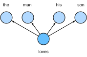

# Co-occurrence matrices with Skip-Gram and CBOW

Co-occurrence matrices are as straightforward as they sound; the big idea is that similar words tend to occur together and will have similar context; for example – Guava is a fruit. Grapefruit is a fruit.
Guava and Grapefruit tend to have a similar context i.e places where fruits are mentioned.

Before we dive into the details of how a co-occurrence matrix is constructed, there are two concepts that need to be clarified – what does Co-Occurrence mean and what is a context window?

Co-occurrence simply means, that for a given corpus, the co-occurrence of a pair of words say $w_1$ and $w_2$ is the number of times they have appeared together in a given context window.

Context window is specified by a number and the direction. So what does a context window of 2 mean? Let's look at an example below:

| **Fabulous**	| **Fairytale**	| _Fox_ | **Flew** | **Far** | From |	Five | Feet | Forwards |
|---|:--:|:-:|:-:|:-:|:-:|:-:|:-:|:-:|

The words "Fabulous", "Fairytale", "Flew", and "Far" (bolded) are in a fixed context window of 2 for the word ‘Fox’ and for calculating the co-occurrence only these words will be counted.

Now, let us take an example corpus to calculate a single co-occurrence matrix.

Corpus =

- He is not lazy.

- He is intelligent.

- He is smart.

| - | He | is  | not  | lazy | intelligent | smart |
|--- |:--:|:-:  |:-:   |:-:   |:-:          |:-:    |
| He | 0 | 	4	| 2 | 1 | 2 | 1 |
| is | 4 | 0  | 1 | 2  | 2 | 1 |
| not | 2 | 1 | 0 | 1 | 0 | 0 |
| lazy	 | 1 | 2 | 1 | 0 | 0 | 0 |
| intelligent |	2 | 2 | 0 | 0 | 0 | 0 |
| smart | 1 | 1 | 0 | 0 | 0 | 0 |

Let us further understand this co-occurrence matrix by examining two examples in the table above.

The box under "is" and to the right of "He" is the number of times ‘He’ and ‘is’ have appeared in the context window 2 and it can be seen that the count turns out to be 4, while the word ‘lazy’ has never appeared with ‘intelligent’ in the context window and therefore has been assigned 0 in the box below intelligent and to the right of lazy.

## Dealing with the co-occurrence matrices and variations of co-occurrence

Numerical representations allow us to use numerical classification methods to analyze our text. If we want to build a document classifier, we can obtain document level vectors for each review and use them as feature vectors to predict the class label. We can then plug this data into any type of classifier. In the last section, we discussed one-hot encoding and document level word embeddings.

By one hot encoding the classes, we can plug this data into any type of classifier
Textual data is rich and high in dimensions, which makes more complex classifiers such as neural networks ideal for NLP.

Let's take a look at this simple example of one-hot encoding once again. The count of unique vocabulary in the corpus is the length of the vector, and the place in which the vocabulary occurred first as the position in the one-hot vector being a 1. For example, if my vocabulary was the following sentence:

> The boy liked the turtles.

The length of the above sentence is five, but there are four unique words in the vocabulary, "the", "boy", "liked", and "turtles." So the length of our embedding vectors for each would be four. For "the," the embedding would look like `[1, 0, 0, 0]`, the embedding for boy would be `[0, 1, 0, 0]`, the embedding for liked would be `[0, 0, 1, 0]`. The embedding for the next "the" would reuse the one-hot vector embedding used previously, and default to `[1, 0, 0, 0]` for every re-occurrence of "the," and lastly, the embedding for turtles would be `[0, 0, 0, 1]`. These don't represent any of the features of syntactic or semantic similarity; these only represent the most basic feature of whether or not a word occurred or not. The same happens with the TF-IDF implementation of word embeddings in the last notebook.

Any calculations or computation that one would like to do with these one-hot vectors or TF-IDF vectors would be a problem as the inherent sparsity of these vectors makes it increasingly inefficient as the vocabulary size increases. That's not to say that they haven't seen any success, but the success is highly limited and easily improvable. We will take a look at how to make these vectors less sparse and more meaningful in a future notebook.

Fortunately, it turns out that a number of efficient techniques
can quickly discover broadly useful word embeddings in an *unsupervised* manner.

These embeddings map each word onto a low-dimensional vector $w \in R^d$ with $d$ commonly chosen to be roughly $100$.
Intuitively, these embeddings are chosen based on the contexts in which words appear.
Words that appear in similar contexts, like "tennis" and "racquet," should have similar embeddings
while words that are not alike, like "rat" and "gourmet," should have dissimilar embeddings.

We will explore the much more complex set of embeddings created using shallow neural networks by focusing on word2vec models. Trained over large corpora, word2vec uses unsupervised learning to determine semantic and syntactic meaning from word co-occurrence from the matrices we described in this notebook, which is used to construct vector representations for every word in the vocabulary.

Word2vec was developed at Google by a research team led by Tomas Mikolov. The research paper covers the topics in depth and can be found [here](https://papers.nips.cc/paper/5021-distributed-representations-of-words-and-phrases-and-their-compositionality.pdf).

The model uses a two layer shallow neural network to find the vector mappings for each word in the corpus. The neural network is used to predict known co-occurrences in the corpus and the weights of the hidden layer are used to create the word vectors. Somewhat surprisingly, word vectors created using this method preserve many of the linear regularities found in language.

[The Efficient Estimation of Word Representations in Vector Space paper](https://arxiv.org/abs/1301.3781) shares the following result:

“Using a word offset technique where simple algebraic operations are performed on the word vectors, it was shown for example that vector(”King”) — vector(”Man”) + vector(”Woman”) results in a vector that is closest to the vector representation of the word Queen.”

This shows that the regularities found in language are somewhat preserved in the word vectors! But how do we actually go from these co-occurrence matrices to the word vectors?

There are two model architectures used to train word2vec: Continuous Bag of Words and Skip Gram. These models determine how textual data is passed into the neural network. Both of these architectures use a context window to determine contextually similar words. A context window with a fixed size n means that all words within n units from the target word belong to its context like mentioned above. To further clarify the meaning of context window and introduce the concept of dynamic contextual windows, let's consider the following sentence:

> "The quick brown fox jumped over the lazy dog."

Fox is our target word and quick, brown, jumped, over belong to the context of fox. The assumption is that with enough examples of contextual similarity, the network is able to learn the correct associations between the words.
This assumption is in line with the distributional hypothesis we presented in the last notebook, which states that “words which are used and occur in the same contexts tend to purport similar meaning.”

The implementation of context window in word2vec though, is dynamic. A dynamic context window has a maximum window size. Context is sampled from the maximum window size with probability $\frac{1}{d}$, where $d$ is the distance between the word to the target.

Consider the target word fox using a dynamic context window with maximum window size of 2. (brown, jumped) have a 1/1 probability of being included in the context since they are one word away from fox. (quick, over) have a 1/2 probability of being included in the context since they are two words away from fox.

Using this concept, the Continuous Bag of Words (BOW) and the Skip Gram model separates data into observations of target words and their context.

### Variations of Co-occurrence Matrix

Let’s say there are V unique words in the corpus. So Vocabulary size = $V$. The columns of the Co-occurrence matrix form the context words. The different variations of Co-Occurrence Matrix are-

A co-occurrence matrix of size $V * V$. Now, for even a decent corpus $V$ gets very large and difficult to handle. So generally, this architecture is never preferred in practice.

A co-occurrence matrix of size $V * N$ where $N$ is a subset of $V$ and can be obtained by removing irrelevant words like stopwords etc. for example. This is still very large and presents computational difficulties.

But, remember this co-occurrence matrix is not the word vector representation that is generally used. Instead, this co-occurrence matrix is decomposed using techniques like PCA, SVD etc. into factors and combination of these factors forms the word vector representation.

Let us illustrate this more clearly. For example, you perform PCA on the above matrix of size $V * V$. You will obtain V principal components. You can choose $k$ components out of these $V$ components. So, the new matrix will be of the form $V * k$.

And, a single word, instead of being represented in $V$ dimensions will be represented in $k$ dimensions while still capturing almost the same semantic meaning. $k$ is generally of the order of hundreds.

So, what PCA does at the back is decompose co-occurrence matrix into three matrices, $U$,$S$ and $V$ where $U$ and $V$ are both orthogonal matrices. What is of importance is that dot product of $U$ and $S$ gives the word vector representation and $V$ gives the word context representation.

---

Let's further dive into depth of firstly, the skip-gram model, followed by the BOW model in its continuous form (CBOW).

## The Skip-Gram Model

The skip-gram model assumes that a word can be used to generate the words that surround it in a text sequence. For example, we assume that the text sequence is "the", "man", "loves", "his", and "son". We use "loves" as the central target word and set the context window size to 2. Given the central target word "loves", the skip-gram model is concerned with the conditional probability for generating the context words, "the", "man", "his" and "son", that are within a distance of no more than 2 words, which is

$$\mathbb{P}(\textrm{"the"},\textrm{"man"},\textrm{"his"},\textrm{"son"}\mid\textrm{"loves"}).$$

We assume that, given the central target word, the context words are generated independently of each other. In this case, the formula above can be rewritten as

$$\mathbb{P}(\textrm{"the"}\mid\textrm{"loves"})\cdot\mathbb{P}(\textrm{"man"}\mid\textrm{"loves"})\cdot\mathbb{P}(\textrm{"his"}\mid\textrm{"loves"})\cdot\mathbb{P}(\textrm{"son"}\mid\textrm{"loves"}).$$

In the skip-gram model, each word is represented as two $d$-dimension vectors, which are used to compute the conditional probability. We assume that the word is indexed as $i$ in the dictionary, its vector is represented as $\mathbf{v}_i\in\mathbb{R}^d$ when it is the central target word, and $\mathbf{u}_i\in\mathbb{R}^d$ when it is a context word.  Let the central target word $w_c$ and context word $w_o$ be indexed as $c$ and $o$ respectively in the dictionary. The conditional probability of generating the context word for the given central target word can be obtained by performing a softmax operation on the vector inner product:

$$\mathbb{P}(w_o \mid w_c) = \frac{\text{exp}(\mathbf{u}_o^\top \mathbf{v}_c)}{ \sum_{i \in \mathcal{V}} \text{exp}(\mathbf{u}_i^\top \mathbf{v}_c)},$$

where vocabulary index set $\mathcal{V} = \{0, 1, \ldots, |\mathcal{V}|-1\}$. Assume that a text sequence of length $T$ is given, where the word at time step $t$ is denoted as $w^{(t)}$. Assume that context words are independently generated given center words. When context window size is $m$, the likelihood function of the skip-gram model is the joint probability of generating all the context words given any center word

$$ \prod_{t=1}^{T} \prod_{-m \leq j \leq m,\ j \neq 0} \mathbb{P}(w^{(t+j)} \mid w^{(t)}),$$

Here, any time step that is less than 1 or greater than $T$ can be ignored. This enforces our context window.

### Skip-Gram Model Training

The skip-gram model parameters are the central target word vector and context word vector for each individual word.  In the training process, we are going to learn the model parameters by maximizing the likelihood function, which is also known as maximum likelihood estimation. This is equivalent to minimizing the following loss function:

$$ - \sum_{t=1}^{T} \sum_{-m \leq j \leq m,\ j \neq 0} \text{log}\, \mathbb{P}(w^{(t+j)} \mid w^{(t)}).$$

If we use SGD, in each iteration we are going to pick shorter subsequences through random sampling to compute the loss for each subsequence, and then compute the gradients to update the model parameters. The key of gradient computation is to compute the gradient of the logarithmic conditional probability for the central word vector and the context word vector. By definition, we first have

$$\log \mathbb{P}(w_o \mid w_c) =
\mathbf{u}_o^\top \mathbf{v}_c - \log\left(\sum_{i \in \mathcal{V}} \text{exp}(\mathbf{u}_i^\top \mathbf{v}_c)\right)$$

Through differentiation, we can get the gradient $\mathbf{v}_c$ from the formula above.

$$
\begin{aligned}
\frac{\partial \text{log}\, \mathbb{P}(w_o \mid w_c)}{\partial \mathbf{v}_c}
&= \mathbf{u}_o - \frac{\sum_{j \in \mathcal{V}} \exp(\mathbf{u}_j^\top \mathbf{v}_c)\mathbf{u}_j}{\sum_{i \in \mathcal{V}} \exp(\mathbf{u}_i^\top \mathbf{v}_c)}\\
&= \mathbf{u}_o - \sum_{j \in \mathcal{V}} \left(\frac{\text{exp}(\mathbf{u}_j^\top \mathbf{v}_c)}{ \sum_{i \in \mathcal{V}} \text{exp}(\mathbf{u}_i^\top \mathbf{v}_c)}\right) \mathbf{u}_j\\
&= \mathbf{u}_o - \sum_{j \in \mathcal{V}} \mathbb{P}(w_j \mid w_c) \mathbf{u}_j.
\end{aligned}
$$

Its computation obtains the conditional probability for all the words in the dictionary given the central target word $w_c$. We then use the same method to obtain the gradients for other word vectors.

After the training, for any word in the dictionary with index $i$, we are going to get its two word vector sets $\mathbf{v}_i$ and $\mathbf{u}_i$.  In applications of natural language processing (NLP), the central target word vector in the skip-gram model is generally used as the representation vector of a word.

## The Continuous Bag Of Words (CBOW) Model

The continuous bag of words (CBOW) model is similar to the skip-gram model. The biggest difference is that the CBOW model assumes that the central target word is generated based on the context words before and after it in the text sequence. With the same text sequence "the", "man", "loves", "his" and "son", in which "loves" is the central target word, given a context window size of 2, the CBOW model is concerned with the conditional probability of generating the target word "loves" based on the context words "the", "man", "his" and "son", such as

$$\mathbb{P}(\textrm{"loves"}\mid\textrm{"the"},\textrm{"man"},\textrm{"his"},\textrm{"son"}).$$

Since there are multiple context words in the CBOW model, we will average their word vectors and then use the same method as the skip-gram model to compute the conditional probability. We assume that $\mathbf{v_i}\in\mathbb{R}^d$ and $\mathbf{u_i}\in\mathbb{R}^d$ are the context word vector and central target word vector of the word with index $i$ in the dictionary (notice that the symbols are opposite to the ones in the skip-gram model). Let central target word $w_c$ be indexed as $c$, and context words $w_{o_1}, \ldots, w_{o_{2m}}$ be indexed as $o_1, \ldots, o_{2m}$ in the dictionary. Thus, the conditional probability of generating a central target word from the given context word is

$$\mathbb{P}(w_c \mid w_{o_1}, \ldots, w_{o_{2m}}) = \frac{\text{exp}\left(\frac{1}{2m}\mathbf{u}_c^\top (\mathbf{v}_{o_1} + \ldots + \mathbf{v}_{o_{2m}}) \right)}{ \sum_{i \in \mathcal{V}} \text{exp}\left(\frac{1}{2m}\mathbf{u}_i^\top (\mathbf{v}_{o_1} + \ldots + \mathbf{v}_{o_{2m}}) \right)}.$$

For brevity, denote $\mathcal{W}_o= \{w_{o_1}, \ldots, w_{o_{2m}}\}$, and $\bar{\mathbf{v}}_o = \left(\mathbf{v}_{o_1} + \ldots + \mathbf{v}_{o_{2m}} \right)/(2m)$. The equation above can be simplified as

$$\mathbb{P}(w_c \mid \mathcal{W}_o) = \frac{\exp\left(\mathbf{u}_c^\top \bar{\mathbf{v}}_o\right)}{\sum_{i \in \mathcal{V}} \exp\left(\mathbf{u}_i^\top \bar{\mathbf{v}}_o\right)}.$$

Given a text sequence of length $T$, we assume that the word at time step $t$ is $w^{(t)}$, and the context window size is $m$.  The likelihood function of the CBOW model is the probability of generating any central target word from the context words.

$$ \prod_{t=1}^{T}  \mathbb{P}(w^{(t)} \mid  w^{(t-m)}, \ldots,  w^{(t-1)},  w^{(t+1)}, \ldots,  w^{(t+m)}).$$

### CBOW Model Training

CBOW model training is quite similar to skip-gram model training.  The maximum likelihood estimation of the CBOW model is equivalent to minimizing the loss function.

$$  -\sum_{t=1}^T  \text{log}\, \mathbb{P}(w^{(t)} \mid  w^{(t-m)}, \ldots,  w^{(t-1)},  w^{(t+1)}, \ldots,  w^{(t+m)}).$$

Notice that

$$\log\,\mathbb{P}(w_c \mid \mathcal{W}_o) = \mathbf{u}_c^\top \bar{\mathbf{v}}_o - \log\,\left(\sum_{i \in \mathcal{V}} \exp\left(\mathbf{u}_i^\top \bar{\mathbf{v}}_o\right)\right).$$

Through differentiation, we can compute the logarithm of the conditional probability of the gradient of any context word vector $\mathbf{v}_{o_i}$($i = 1, \ldots, 2m$) in the formula above.

$$\frac{\partial \log\, \mathbb{P}(w_c \mid \mathcal{W}_o)}{\partial \mathbf{v}_{o_i}} = \frac{1}{2m} \left(\mathbf{u}_c - \sum_{j \in \mathcal{V}} \frac{\exp(\mathbf{u}_j^\top \bar{\mathbf{v}}_o)\mathbf{u}_j}{ \sum_{i \in \mathcal{V}} \text{exp}(\mathbf{u}_i^\top \bar{\mathbf{v}}_o)} \right) = \frac{1}{2m}\left(\mathbf{u}_c - \sum_{j \in \mathcal{V}} \mathbb{P}(w_j \mid \mathcal{W}_o) \mathbf{u}_j \right).$$

We then use the same method to obtain the gradients for other word vectors. Unlike the skip-gram model, we usually use the context word vector as the representation vector for a word in the CBOW model.

## Useful Resources to understand these concepts better

Here is a [link](https://ronxin.github.io/wevi/) to visualize CBOW and Skip-gram a bit better. You can see the actual neural networks being built and the input and output vector visualizations to make the conceptual side of this even easier to grasp. There is also a good simple explanation of both models [here](https://www.analyticsvidhya.com/blog/2017/06/word-embeddings-count-word2veec/) but lacking in the mathematics included in this notebook.
